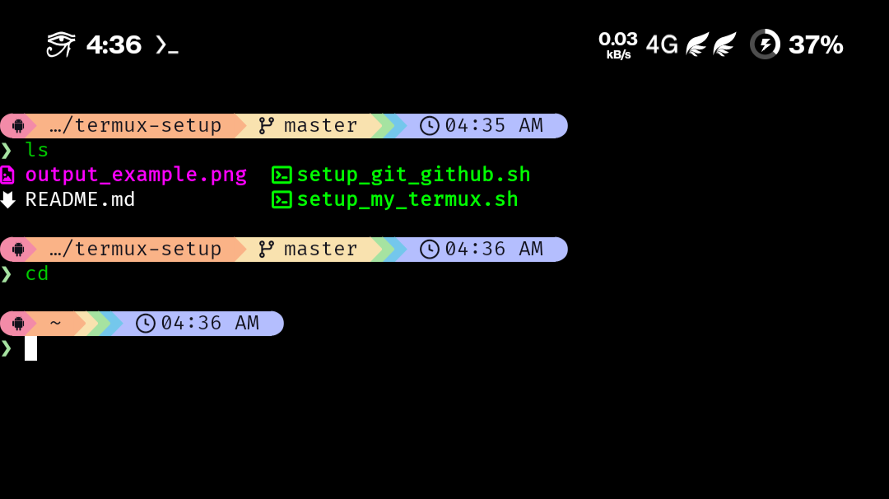

## **📱 Termux Unified Setup Script**

A modular suite of scripts to automate and customize your development environment on Android. It supports both **Native Termux** and **Proot-Distro (Ubuntu/Debian)** environments.

The goal: Transform a fresh install into a powerful, visually appealing CLI workspace with minimal effort.

---

## 🖥️ Output Example
<p align="center">
  
</p>


---

## ✨ Features (Common)

- **Enhanced UI:** Color-coded logs, progress spinners, and stylish banners.
- **Shell & Prompt:** Installs **Zsh**, **Oh My Zsh**, and the **Starship** prompt.
- **Plugins:** Auto-installs `zsh-autosuggestions` and `zsh-syntax-highlighting`.
- **Git Integration:** Auto-configures global user/email, generates `ed25519` SSH keys, and tests GitHub connectivity. Includes a custom `upload` alias for quick commits.
- **Config Management:** Automatically backs up existing files (`.zshrc`, `starship.toml`) before overwriting.

---

## 📦 Components

### 1. `setup.sh` (Native Termux)
Designed for the host Termux environment.
- **Storage:** Requests Android storage access.
- **Font:** Installs **FiraCode Nerd Font** for icon support.
- **Tools:** `lsd`, `htop`, `micro`, `openssh`, etc.

### 2. `proot-debian-setup.sh` (Ubuntu/Debian Proot)
An advanced adapter for Linux distributions running via `proot-distro`.
- **Sudo-Aware:** Automatically detects if running as **Root** or **User**. Uses `sudo` for system commands when needed.
- **Conflict Resolution:** Configures `.zshrc` to prioritize native container paths (`/usr/bin`) over Termux host paths, fixing "binary bleeding" issues.
- **Latest Starship:** Installs Starship via the official installer to `/usr/local/bin`, ensuring the latest version (avoiding stale apt packages).
- **Multi-User:** Can be used to set up the Root account *and* regular users.

---

## 🚀 Quick Start (Native Termux)

```bash
pkg update && pkg upgrade -y && pkg install git -y
git clone https://github.com/sms1sis/termux-setup.git
cd termux-setup
chmod +x setup.sh

# Run full setup
./setup.sh all --switch
```

---

## 🐧 Usage: Proot-Distro (Ubuntu/Debian)

The script is **Sudo-Aware**. If you are running as a regular user with sudo privileges, it will automatically handle system-level installations while keeping your personal configuration in your home directory.

### **Direct Setup (Recommended)**
Log in as your preferred user and run the script. It will prompt for your sudo password when installing system tools.

```bash
# Login as your user (e.g., sms1sis)
proot-distro login ubuntu --user <your_username>

# Run the setup script
./proot-debian-setup.sh all --switch
```

### **Fallback: Root-First Setup**
If `sudo` is not yet installed in your container or your user lacks permissions:
1. Log in as **root** (`proot-distro login ubuntu`) and run `./proot-debian-setup.sh base` to install `sudo` and core tools.
2. Log in as your **user** and run `./proot-debian-setup.sh all --switch` to finish your personal configuration.

---

## ⚡ Setup Commands

| Command | Description |
| :--- | :--- |
| `./setup.sh all --switch` | Run full suite and switch shell on next login. |
| `./setup.sh base` | Install base packages only. |
| `./setup.sh tools` | Install developer utilities. |
| `./setup.sh zsh` | Configure Zsh + Oh My Zsh + Plugins. |
| `./setup.sh starship` | Configure Starship prompt & choose preset. |
| `./setup.sh git` | Setup Git user & generate SSH keys. |

---

## 🛠️ Troubleshooting

- **Proot Path Issues:** If `which starship` points to `/data/data/...`, the script's path fix hasn't applied. Ensure your `.zshrc` starts with `export PATH=/usr/local/bin:...`.
- **Permission Denied:** If setup fails in Proot, ensure you ran **Step 1** as root first to install `sudo`.

---

## 🙌 Credits

- [Starship](https://github.com/starship/starship) — minimal, blazing‑fast, infinitely customizable prompt  
- [Termux](https://github.com/termux/termux-app) — the Android terminal emulator that makes this possible